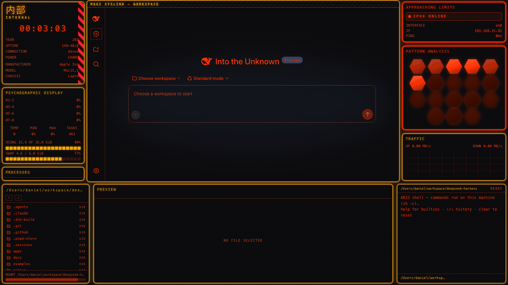
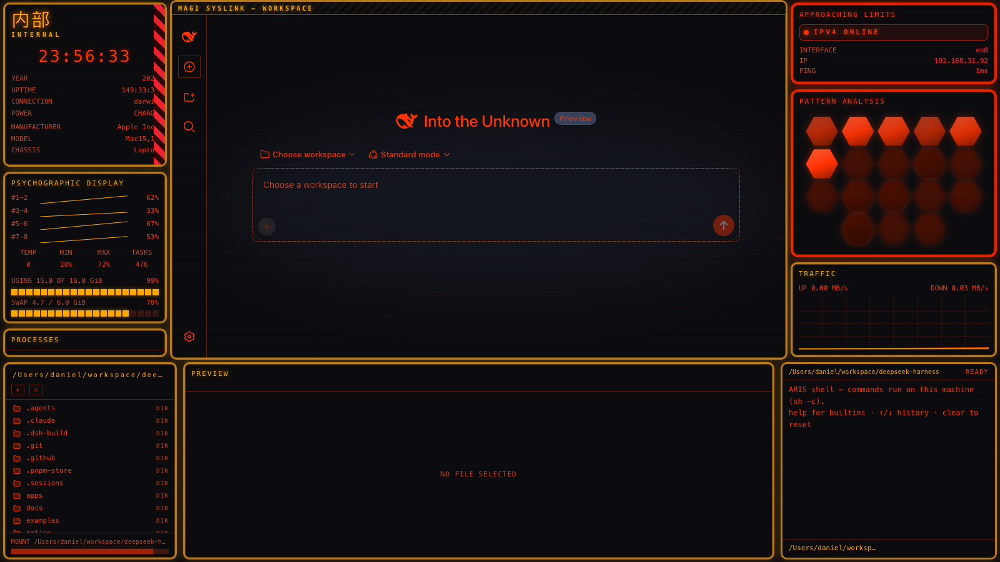

# dsh-edex-mecha-ui

**MECHA — a NERV/Evangelion-style klaxon alert HUD for the DeepSeek Harness web GUI.** A
reference-driven eDEX-UI variant: thick rounded neon panels in a two-tone warning-orange /
klaxon-red system on a pure-black canvas, hazard stripes, and a glowing hexagonal warning
grid — wrapped around the fully intact original workspace UI.





Derived from an Evangelion-UI-artboard reference
([charlintosh/evangelion-ui-artboard](https://github.com/charlintosh/evangelion-ui-artboard)),
analyzed pixel-by-pixel (klaxon red `#ff3300`, warning orange `#ffaa00`, hazard red-pink
`#ff2533`, pure-black canvas `#000000`).

## Install

```sh
pnpm dsh plugin --profile <profile> add @danielng23/dsh-edex-mecha-ui
```

The bundle pulls its three sub-packages from npm:

| Package | Role |
|---|---|
| `@danielng23/dsh-edex-mecha-ui` | bundle (cordis patch wiring the shell + theme + host remote) |
| `@danielng23/dsh-mecha-client-ui-edex` | the MECHA shell frame client |
| `@danielng23/dsh-mecha-client-ui-theme-terminal` | klaxon alert-HUD token theme + Appearance row |
| `@danielng23/dsh-mecha-host-system-metrics` | system-monitor Host Remote (panel data) |

## The MECHA shell

Every element is its own **closed rounded neon rectangle** — near-black fill, 3px border,
lighter inner keyline, ~10px radius, hue-matched glow — exactly the reference's two-tone
system:

- **Orange variant** (`#b77920` border, `#ffaa00` glow, amber titles): the general widget
  cards, the workspace container, the INTERNAL card, TRAFFIC.
- **Red variant** (`#e32200` border, `#ff3300` glow, red titles, 4px): `APPROACHING LIMITS`
  and `PATTERN ANALYSIS` — the alert row.

### Widgets

- **INTERNAL** (left bar, replaces the stock info card) — huge 内部 glyphs in warning orange
  with dark outline + glow, the `INTERNAL` label, and a vertical ~45° hazard-stripe block
  (`#ff2533` / `#2c0401`) clipped into the card's right edge; the live clock and the
  hardware spec readouts continue underneath.
- **PSYCHOGRAPHIC DISPLAY** (left bar, replaces the stock CPU card) — per-core sparklines,
  TEMP/MIN/MAX/TASKS metrics, and memory/swap block bars restyled in warning orange.
- **APPROACHING LIMITS** (right bar, replaces the stock network-status card) — the live
  interface state under a blinking klaxon marker, in the red alert-banner frame.
- **PATTERN ANALYSIS** (right bar, **featured widget replacing WORLD VIEW**) — the
  reference's signature element: an 18-cell glowing red-orange hexagonal warning matrix in
  staggered rows with near-black gaps and a diffuse red glow. Cell brightness derives from
  the live network snapshot; the cells blink in a staggered klaxon flicker (opacity-only).
- **MAGI SYSLINK title strip** frames the original workspace in the same card chrome (the
  workspace itself stays untouched and interactive beneath it).
- PROCESSES, TRAFFIC, DIR/PREVIEW/TERMINAL keep their slots, recolored by the theme.

### Theme mechanics

One accent drives everything (`Settings → General → Theme Color`, default klaxon
`#ff3300`): the shell palette (`--edex-*`), the terminal composer/sidebar overrides, and
the alias-token layer that recolors the original UI (`--dsw-alias-*`), with fixed semantic
accents (warn `#ffaa00`, error `#ff2533`). The workspace background tokens read the same
near-black card surface (`#0a0b0e`) as the shell cards, so the whole canvas is one surface.

## Development

```sh
pnpm install && ./scripts/link-harness.sh   # + harness @deepseek-ai/* symlinks
pnpm build                                  # harness tsdown toolchain
```

See `WIDGETS.md` for the swappable-widget registry and `analysis.json` / `analysis.md` for
the measured reference analysis this theme was built from.

## License

MIT
